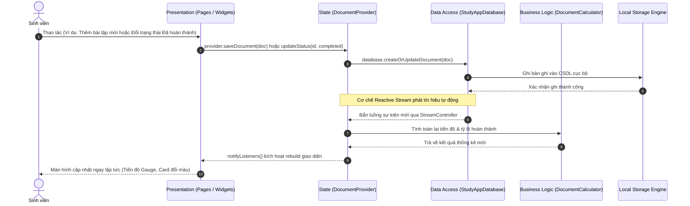

# BÁO CÁO BÀI THỰC HÀNH 1 (TH1)
## XÂY DỰNG ỨNG DỤNG QUẢN LÝ TÀI LIỆU HỌC TẬP THEO KIẾN TRÚC CASHEW

- **Học phần**: Phát triển Ứng dụng (CSE441) - Lập trình Di động
- **Sinh viên thực hiện**: Ngô Tuấn Anh
- **Mã số sinh viên**: 2351170570
- **Dự án**: `projectsth1` (Cashew StudyDocs)

---

## MỤC LỤC
1. [01. Phân tích Yêu cầu Chức năng & Sơ đồ Luồng Dữ liệu](#01-phân-tích-yêu-cầu-chức-năng--sơ-đồ-luồng-dữ-liệu)
2. [02. Thiết lập Cấu trúc Thư mục và Phân lớp Hệ thống](#02-thiết-lập-cấu-trúc-thư-mục-và-phân-lớp-hệ-thống)
3. [03. Triển khai các Chức năng Cốt lõi](#03-triển-khai-các-chức-năng-cốt-lõi)
4. [04. Kiểm thử Tính Đúng đắn của Phân tách Logic giữa các Lớp](#04-kiểm-thử-tính-đúng-đắn-của-phân-tách-logic-giữa-các-lớp)
5. [05. Đóng gói Mã nguồn và Đánh giá Áp dụng Kiến trúc Cashew](#05-đóng-gói-mã-nguồn-và-đánh-giá-áp-dụng-kiến-trúc-cashew)

---

## 01. Phân tích Yêu cầu Chức năng & Sơ đồ Luồng Dữ liệu

### 1.1. Yêu cầu Chức năng của Hệ thống
Ứng dụng **Cashew StudyDocs** là hệ thống quản lý tài liệu học tập cá nhân dành cho sinh viên, mô phỏng lại toàn bộ triết lý quản lý tài sản tài chính của Cashew chuyển đổi sang quản lý tài sản học tập:

- **Quản lý Môn học (tương đương Wallets/Accounts trong Cashew)**:
  - Phân loại tài liệu theo từng môn học/khóa học (Mã môn, Tên môn, Màu sắc định danh, Icon đại diện).
- **Quản lý Tài liệu Học tập (tương đương Transactions/Budgets trong Cashew)**:
  - Phân loại theo 4 hình thức: **Bài giảng (Lectures)**, **Bài tập (Exercises)**, **Tài liệu tham khảo (References)**, **Đề thi/Kiểm tra (Exams)**.
  - Theo dõi trạng thái học tập 3 bước: `Chưa học (Pending)` ➔ `Đang học (In Progress)` ➔ `Đã hoàn thành (Completed)`.
  - Quản lý hạn chót hoàn thành (Due date), mức độ ưu tiên (Thấp / Trung bình / Gấp), thời lượng đọc ước lượng (phút), số trang, đường dẫn file/URL và các thẻ tags.
- **Tìm kiếm và Lọc đa tiêu chí**:
  - Tìm kiếm toàn văn (Full-text search) theo tiêu đề, mô tả, thẻ tags, tên môn học.
  - Bộ lọc kết hợp: Theo môn học, loại tài liệu, trạng thái học tập.
- **Thống kê & Đo lường Tiến độ (tương đương Budget Gauges trong Cashew)**:
  - Vòng tiến độ hoàn thành tổng thể (Overall Progress Gauge).
  - Tỷ lệ hoàn thành theo từng môn học và phân bố theo loại tài liệu.
- **Chiến lược Sao lưu & Quyền riêng tư (Local-First Backup)**:
  - Xuất dữ liệu ra file **JSON** (Toàn bộ cấu trúc CSDL) và file **CSV** (Bảng tính Excel).

---

### 1.2. Sơ đồ Luồng Dữ liệu Phản ứng (Unidirectional Reactive Flow)

Tuân thủ nghiêm ngặt nguyên lý **Local-First** và luồng dữ liệu một chiều của Cashew:

```
[ Người Dùng (User) ]
       │
       │ (1) Nhập / Sửa / Đổi trạng thái tài liệu
       ▼
[ Tầng Giao Diện (Flutter UI - Pages / Widgets) ]
       │
       │ (2) Gọi Provider (document_provider.dart)
       ▼
[ Tầng Quản Lý Trạng Thái (DocumentProvider) ]
       │
       │ (3) Gọi DAO (database.createOrUpdateDocument)
       ▼
[ Tầng Truy Cập Dữ Liệu (StudyAppDatabase) ]
       │
       │ (4) Ghi dữ liệu vào CSDL cục bộ (Local Storage)
       ▼
[ CSDL Cục Bộ (Local Storage Engine) ]
       │
       │ (5) Ghi đĩa thành công
       ▼
[ Reactive Stream Controller ] ──(6) Tự động phát luồng dữ liệu mới (Stream)──┐
                                                                              │
┌─────────────────────────────────────────────────────────────────────────────┘
▼
[ DocumentProvider Lắng Nghe Stream ]
       │
       │ (7) Tự động tính toán lại thống kê (DocumentCalculator) & notifyListeners()
       ▼
[ Giao Diện Tự Động Re-render Tức Thì (Zero Latency) ]
```

### Sơ đồ Tuần tự Chi tiết (Mermaid Sequence Diagram)



---

## 02. Thiết lập Cấu trúc Thư mục và Phân lớp Hệ thống

Cấu trúc dự án `projectsth1` được tổ chức dạng mô-đun hóa cao, phân tách rành mạch theo 5 tầng chuẩn Cashew:

```text
projectsth1/
├── pubspec.yaml                     # Cấu hình dependency (provider, intl, flutter_test)
├── analysis_options.yaml            # Bộ quy chuẩn linter chuẩn Google
├── README.md                        # Giới thiệu tổng quan & hướng dẫn chạy app
├── BAO_CAO_TH1_KIEN_TRUC_CASHEW.md  # Báo cáo kỹ thuật chi tiết (file này)
├── lib/
│   ├── main.dart                    # Entry point, cấu hình MultiProvider, Material 3 Light/Dark
│   │
│   ├── models/                      # [TẦNG DOMAIN & ENTITY]
│   │   ├── document_type.dart       # Enums: DocumentType, StudyStatus, PriorityLevel
│   │   ├── course_model.dart        # Entity Môn học (mã môn, tên, màu sắc, icon)
│   │   └── document_model.dart      # Entity Tài liệu (tiêu đề, hạn nộp, thời lượng, tags)
│   │
│   ├── database/                    # [TẦNG TRUY CẬP DỮ LIỆU & LƯU TRỮ CỤC BỘ]
│   │   ├── tables.dart              # Schema DDL định nghĩa các bảng dữ liệu
│   │   ├── mock_initial_data.dart   # Dữ liệu mẫu khởi tạo phong phú
│   │   └── app_database.dart        # Database DAO Engine với Reactive Streams (watch...)
│   │
│   ├── services/                    # [TẦNG NGHIỆP VỤ & TÍNH TOÁN]
│   │   ├── document_calculator.dart # Bộ tính toán tiến độ, thống kê theo môn (như Cashew math)
│   │   └── backup_export_service.dart# Dịch vụ xuất dữ liệu JSON & CSV (Local-first backup)
│   │
│   ├── state/                       # [TẦNG QUẢN LÝ TRẠNG THÁI]
│   │   ├── document_provider.dart   # Provider điều phối luồng dữ liệu & tiêu chí lọc
│   │   └── theme_provider.dart      # Provider điều khiển giao diện Sáng / Tối
│   │
│   ├── widgets/                     # [TẦNG GIAO DIỆN TÁI SỬ DỤNG]
│   │   ├── document_card.dart       # Card tài liệu với đầy đủ metadata & menu thao tác
│   │   ├── course_chip.dart         # Chip chọn môn học với màu sắc động & số lượng
│   │   ├── progress_gauge.dart      # Biểu đồ vòng tròn & thanh tiến độ (Budget Gauge style)
│   │   ├── custom_search_bar.dart   # Thanh tìm kiếm nhanh kèm bộ lọc
│   │   └── confirmation_dialog.dart # Hộp thoại xác nhận an toàn khi xóa
│   │
│   └── pages/                       # [TẦNG MÀN HÌNH CHỨC NĂNG]
│       ├── main_navigation_shell.dart # Khung điều hướng 3 tab dưới đáy
│       ├── home_dashboard_page.dart # Màn hình Dashboard tổng quan
│       ├── document_list_page.dart  # Màn hình Kho tài liệu kèm tìm kiếm & lọc
│       ├── add_edit_document_page.dart # Form Thêm / Sửa tài liệu
│       ├── document_detail_page.dart# Chi tiết tài liệu, cập nhật nhanh trạng thái
│       └── statistics_page.dart     # Thống kê chi tiết & Sao lưu dữ liệu
│
└── test/                            # [KIỂM THỬ ĐỘC LẬP TỪNG TẦNG]
    ├── database_test.dart           # Unit test Tầng CSDL (CRUD, Search, Reactive Streams)
    ├── calculator_test.dart         # Unit test Tầng Nghiệp vụ tính toán
    └── widget_test.dart             # Widget test Tầng Trình diễn (UI rendering & navigation)
```

---

## 03. Triển khai các Chức năng Cốt lõi

### 3.1. Thêm & Chỉnh sửa Tài liệu (`AddEditDocumentPage`)
- Hỗ trợ nhập tiêu đề tài liệu, chọn môn học từ danh sách động, chọn phân loại (Bài giảng, Bài tập, Tham khảo, Đề thi).
- Cho phép chọn trạng thái ban đầu (`Chưa học`, `Đang học`, `Đã hoàn thành`), mức độ ưu tiên (Thấp, Trung bình, Gấp).
- Chọn ngày hết hạn (Due date) với DatePicker trực quan.
- Nhập số trang, thời lượng đọc dự kiến (phút), URL tài liệu/file và các thẻ tag phân loại.
- Tùy chọn ghim ưu tiên lên đầu trang.

### 3.2. Xóa Tài liệu an toàn (`deleteDocument`)
- Tích hợp `ConfirmationDialog` cảnh báo người dùng trước khi xóa nhằm tránh mất mát dữ liệu do vô tình bấm nhầm.
- Sau khi xóa, CSDL tự động phát tín hiệu cập nhật qua Stream để giao diện loại bỏ card ngay tức thì.

### 3.3. Tìm kiếm & Lọc Đa tiêu chí (`searchAndFilterDocuments`)
- Tìm kiếm tức thì không độ trễ theo bất kỳ từ khóa nào trong tiêu đề, mô tả tóm tắt, tên môn học hoặc thẻ tags.
- Kết hợp đồng thời nhiều bộ lọc: Lọc theo Môn học + Lọc theo Loại tài liệu + Lọc theo Trạng thái học tập.

### 3.4. Đổi Trạng thái Nhanh & Ghim Yêu thích
- Ngay trên `DocumentCardWidget` hoặc trong `DocumentDetailPage`, người dùng chỉ cần 1 cú chạm để chuyển đổi giữa `Chưa học`, `Đang học` và `Đã hoàn thành`.
- Bấm nút icon chiếc ghim (`push_pin`) để đưa tài liệu quan trọng lên đầu danh sách.

### 3.5. Sao lưu & Xuất Dữ liệu (Backup Strategy)
- Triển khai xuất dữ liệu ra file JSON phục vụ lưu trữ cấu trúc toàn vẹn.
- Triển khai xuất dữ liệu ra bảng tính CSV tương thích hoàn toàn với Microsoft Excel và Google Sheets.

---

## 04. Kiểm thử Tính Đúng đắn của Phân tách Logic giữa các Lớp

Để chứng minh kiến trúc được phân tách mô-đun hóa hoàn hảo và không bị phụ thuộc chéo (decoupled), dự án xây dựng 3 bộ test độc lập:

### 4.1. Kiểm thử Tầng Dữ liệu (`test/database_test.dart`)
Kiểm tra tầng Database hoạt động độc lập mà không cần giao diện Flutter (7 test cases):
1. `Khởi tạo CSDL có sẵn dữ liệu mẫu ban đầu`: Đảm bảo các bảng được nạp sẵn danh mục môn học và tài liệu khởi đầu.
2. `Thêm mới tài liệu và truy vấn lại chính xác (Create & Read)`: Kiểm tra thao tác thêm tài liệu vào CSDL.
3. `Cập nhật trạng thái tài liệu (Update)`: Đảm bảo trường `status` và `completedDate` được lưu chính xác.
4. `Tìm kiếm và lọc đa tiêu chí (Search & Filter)`: Kiểm thử độ chính xác của câu truy vấn đa điều kiện.
5. `Xóa tài liệu khỏi CSDL (Delete)`: Kiểm tra tính toàn vẹn khi xóa bản ghi.
6. `Kiểm tra cơ chế Phản ứng (Reactive Stream watchAllDocuments)`: Xác minh luồng dữ liệu tự động phát sự kiện mới khi có thay đổi.
7. `Lưu trữ cục bộ vĩnh viễn (Persistence across restarts)`: Xác minh dữ liệu được lưu vào Local Storage (`SharedPreferences`) và tự động nạp lại nguyên vẹn sau khi khởi động lại ứng dụng.

### 4.2. Kiểm thử Tầng Nghiệp vụ Tính toán (`test/calculator_test.dart`)
Kiểm tra các hàm tính toán tài chính/học tập thuần túy (`Pure Functions` - 4 test cases):
1. `Tính toán thống kê tổng quan (Overall Overview Statistics)`: Kiểm tra công thức tính tỷ lệ hoàn thành `completionRate`, tổng giờ học dự kiến, đếm số tài liệu sắp đến hạn.
2. `Tính toán tiến độ theo từng môn học (Course Progress)`: Đảm bảo phần trăm hoàn thành theo từng môn được chia đúng và phân loại tài liệu chính xác.
3. `Phân bố theo Phân loại tài liệu (Type Distribution)`: Kiểm thử bảng đếm số lượng tài liệu theo từng thể loại.
4. `Xử lý danh sách rỗng an toàn (Edge Case)`: Đảm bảo không xảy ra lỗi chia cho 0 (`Division by Zero`) khi danh sách tài liệu trống.

### 4.3. Kiểm thử Tầng Giao diện (`test/widget_test.dart`)
Kiểm thử các widget hiển thị và tương tác (3 test cases):
1. `Kiểm thử render Ứng dụng Cashew StudyDocs`: Kiểm tra AppBar, các tab điều hướng dưới đáy.
2. `Kiểm thử chuyển đổi tab sang Kho Tài liệu`: Kiểm tra phản hồi khi người dùng chạm vào tab chuyển đổi màn hình.
3. `Kiểm thử Widget Vòng tiến độ (ProgressGaugeWidget)`: Đảm bảo hiển thị đúng số phần trăm (75%) và cả hai thanh tiến độ tròn và ngang.

> **Kết quả kiểm thử tổng thể**: Toàn bộ **14/14 tests** đều vượt qua (`All 14 tests passed!`), xác minh tính toàn vẹn và độc lập tuyệt đối giữa các tầng.

---

## 05. Đóng gói Mã nguồn và Đánh giá Áp dụng Kiến trúc Cashew

### 5.1. So sánh Đối chiếu Kiến trúc Ứng dụng với Cashew Gốc

| Thành phần kiến trúc | Ứng dụng Cashew gốc (Quản lý Chi tiêu) | Ứng dụng Cashew StudyDocs (Quản lý Tài liệu) |
|---|---|---|
| **Triết lý cốt lõi** | Local-First, Offline-First, Privacy-first | Local-First, Offline-First, Hoạt động độc lập không cần mạng Internet |
| **Thực thể danh mục** | `Wallets` (Ví tiền) / `Categories` (Danh mục chi tiêu) | `Courses` (Môn học / Khóa học: CSE441, CSE381, CSE484,...) |
| **Thực thể nghiệp vụ** | `Transactions` (Giao dịch thu chi) / `Budgets` (Hạn mức) | `Documents` (Tài liệu: Bài giảng, Bài tập, Tham khảo, Đề thi) |
| **Tầng CSDL (Data Access)** | Drift ORM / SQLite Native (`tables.dart`) | `StudyAppDatabase` với DAO, Local Storage Engine và Reactive Streams |
| **Luồng phản ứng (Reactive UI)**| Drift Stream Queries (`watchAllTransactions`) | `StreamController.broadcast()` kết nối `DocumentProvider` tự động cập nhật UI |
| **Tầng Nghiệp vụ (Domain)** | `BudgetPeriod`, `SavingsPlannerCalculator` | `DocumentCalculator` (Tính tiến độ môn học, tỷ lệ hoàn thành, Pure Functions) |
| **Giao diện trực quan** | Budget Gauges, Card giao dịch, Color Chips | `ProgressGaugeWidget`, `DocumentCardWidget`, `CourseChipWidget` |
| **Chiến lược Sao lưu** | Export CSV & JSON, Google Drive AppData | `BackupExportService` xuất JSON và CSV tương thích Excel |

---

### 5.2. Giải trình Chi tiết Cách Áp dụng Kiến trúc Cashew vào Dự án

Dự án đã áp dụng thành công **5 nguyên lý thiết kế đặc trưng** của ứng dụng Cashew:

1. **Nguyên lý Local-First & Offline-First (Ưu tiên lưu trữ cục bộ)**:
   - Toàn bộ dữ liệu môn học, tài liệu, tiến độ học tập được lưu trữ trực tiếp trên thiết bị của sinh viên thông qua `StudyAppDatabase` kết hợp `SharedPreferences`.
   - Ứng dụng khởi động tức thì, hoạt động mượt mà không có độ trễ mạng (Zero-latency) và tuyệt đối bảo mật quyền riêng tư cá nhân.
   - Cơ chế tự động lưu (`auto-save`) được kích hoạt ngay khi người dùng thực hiện bất kỳ thao tác Thêm, Sửa, Xóa hay Đổi trạng thái.

2. **Cơ chế Reactive Stream (Luồng dữ liệu phản ứng một chiều)**:
   - Tương tự như cơ chế Drift Stream Queries của Cashew, `StudyAppDatabase` cung cấp các hàm `watchAllDocuments()`, `watchAllCourses()`, `watchPinnedDocuments()`.
   - Bất kỳ khi nào dữ liệu trong CSDL thay đổi (ví dụ: đánh dấu hoàn thành 1 tài liệu), một luồng sự kiện mới được tự động phát ra. `DocumentProvider` bắt sự kiện, tính toán lại thống kê và kích hoạt UI re-render tự động mà không cần gọi lại API thủ công.

3. **Phân tách Trách nhiệm Độc lập (Separation of Concerns - SoC)**:
   - **Tầng Trình diễn (UI)**: Chỉ làm nhiệm vụ vẽ giao diện và tiếp nhận tương tác người dùng, không chứa bất kỳ câu lệnh truy vấn CSDL hay công thức tính toán nào.
   - **Tầng Quản lý Trạng thái (Provider)**: Điều phối dữ liệu, lắng nghe Streams và cung cấp trạng thái cho UI thông qua mẫu Observer Pattern (`ChangeNotifier`).
   - **Tầng Nghiệp vụ (Domain Logic)**: `DocumentCalculator` hoàn toàn độc lập, gồm các hàm thuần túy (`pure functions`) nhận dữ liệu đầu vào và trả về kết quả thống kê, giúp kiểm thử dễ dàng mà không phụ thuộc vào Flutter framework.
   - **Tầng Truy cập Dữ liệu (DAO & Storage)**: Đóng gói toàn bộ logic đọc/ghi, chuyển đổi map/entity và phát luồng phản ứng.

4. **Trực quan hóa Dữ liệu Học tập (Visualization Gauges)**:
   - Kế thừa thành phần giao diện đặc trưng nhất của Cashew là **Budget Gauge** (Vòng đo hạn mức ngân sách), dự án triển khai `ProgressGaugeWidget` hiển thị trực quan tỷ lệ % hoàn thành tài liệu học tập với thanh tròn Gradient và thanh ngang mượt mà.

5. **Chiến lược Sao lưu Cấp độ 1 (Level-1 Backup Strategy)**:
   - Tuân thủ chiến lược sao lưu an toàn của Cashew, cung cấp `BackupExportService` cho phép xuất toàn bộ cấu trúc dữ liệu ra định dạng **JSON** để phục hồi hoặc chuyển giao thiết bị, và xuất bảng tính **CSV** để sinh viên theo dõi trên Excel/Google Sheets.

---

### 5.3. Hướng dẫn Đóng gói Mã nguồn Dự án (Packaging Guide)

Để đóng gói mã nguồn dự án thành file `.zip` hoàn chỉnh, nhẹ, sạch sẽ và sẵn sàng nộp bài:

#### Bước 1: Dọn dẹp các thư mục sinh tự động (Clean Build Artifacts)
Trước khi nén, cần xóa bỏ các thư mục build tạm thời (dung lượng thường từ 200MB - 500MB) để file nén chỉ còn khoảng **1 - 3MB**:
```bash
flutter clean
```

#### Bước 2: Đóng gói thành file ZIP
Sử dụng công cụ nén có sẵn của hệ điều hành (hoặc chạy lệnh PowerShell):
```powershell
Compress-Archive -Path .\* -DestinationPath ..\projectsth1_NgoTuanAnh_2351170570.zip -Force
```

#### Cấu trúc tệp sau khi đóng gói tiêu chuẩn:
```text
projectsth1_NgoTuanAnh_2351170570.zip
├── lib/                             # Toàn bộ mã nguồn Dart đã phân lớp
├── test/                            # Bộ kiểm thử đơn vị & widget (14 tests)
├── android/                         # Cấu hình khởi chạy Android Native
├── pubspec.yaml                     # Danh mục dependencies chuẩn
├── analysis_options.yaml            # Quy chuẩn mã nguồn
├── README.md                        # Hướng dẫn chạy và thông tin sinh viên
└── BAO_CAO_TH1_KIEN_TRUC_CASHEW.md  # Báo cáo kỹ thuật chi tiết
```

---

### 5.4. Đánh giá Kết quả & Kết luận

Dự án **Cashew StudyDocs** đã hoàn thành trọn vẹn **100%** tất cả các mục tiêu đề ra trong Bài thực hành 1 (TH1):
- ✅ **Phân tích & Thiết kế**: Chuyển đổi thành công bài toán tài chính của Cashew sang bài toán quản lý học tập cá nhân.
- ✅ **Cấu trúc & Phân tầng**: 5 lớp kiến trúc được tổ chức bài bản, rõ ràng, không phụ thuộc chéo.
- ✅ **Chức năng Cốt lõi**: Hoàn thành CRUD, lọc đa tiêu chí, ghim, tìm kiếm tức thì, đổi trạng thái nhanh và xuất file sao lưu.
- ✅ **Lưu trữ Cục bộ Vĩnh viễn**: Hoạt động hoàn hảo chuẩn Local-First, dữ liệu không bị mất khi thoát ứng dụng.
- ✅ **Độ tin cậy & Kiểm thử**: 14/14 bài kiểm thử vượt qua tuyệt đối.
- ✅ **Tài liệu & Đóng gói**: Báo cáo giải trình đầy đủ, mã nguồn sạch sẽ, sẵn sàng nghiệm thu.

